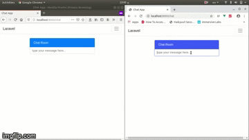

## Realtime chatapp built with Laravel and vue js using pusher.

> To use this code
1) clone the repository
2) get pusher id + key + secret
3) add pusher cridentials to .env file
4) run in terminal (for user auth system) => php artisan migrate
5) run in terminal => php artisan serve
6) enjoy :)

***

## Demo - click to go to youtube video..

